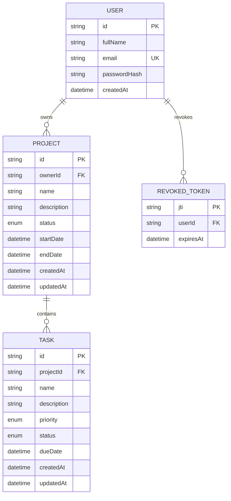

# Database schema

PostgreSQL relational schema is managed with Prisma. `apps/api/prisma/schema.prisma` is the source definition.

Deleting a user cascades to owned projects and revoked tokens; deleting a project cascades to its tasks. User email is unique. Indexes support owner/status project queries, task filters, and token expiry cleanup.
